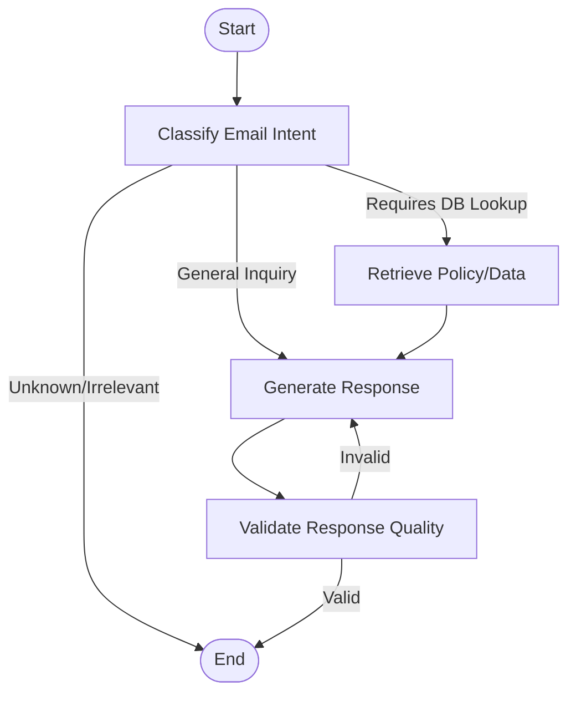

# Overview of MAT496

In this course, we have primarily learned Langgraph. This is helpful tool to build apps which can process unstructured `text`, find information we are looking for, and present the format we choose. Some specific topics we have covered are:

- Prompting
- Structured Output 
- Semantic Search
- Retreaval Augmented Generation (RAG)
- Tool calling LLMs & MCP
- Langgraph: State, Nodes, Graph

We also learned that Langsmith is a nice tool for debugging Langgraph codes.

------

# Capstone Project objective

The first purpose of the capstone project is to give a chance to revise all the major above listed topics. The second purpose of the capstone is to show your creativity. Think about all the problems which you can not have solved earlier, but are not possible to solve with the concepts learned in this course. For example, We can use LLM to analyse all kinds of news: sports news, financial news, political news. Another example, we can use LLMs to build a legal assistant. Pretty much anything which requires lots of reading, can be outsourced to LLMs. Let your imagination run free.


-------------------------

# Project report Template

## Title: Intelligent Gmail Customer Service Agent

## Overview

My project is an intelligent Chrome extension for Gmail that automates customer service interactions. It uses a hybrid AI approach: a CNN-based model for spam filtering and a LangGraph-based agent for generating responses. The system intercepts emails, checks for spam, and if legitimate, uses an LLM to classify the intent (return, refund, damage, general) and generates a policy-compliant response using company data.

## Reason for picking up this project

This project is aligned with the course content as it integrates multiple advanced LLM concepts:

- **Prompting**: I designed specific prompts for classification and response generation (`prompts.py`).
- **Structured Output**: I used Pydantic models (`schemas.py`) to ensure the LLM outputs valid JSON for the application logic.
- **Tool Calling**: The agent uses custom tools (`database.py`) to fetch return policies and calculate refunds.
- **LangGraph**: The core logic is built as a state machine (`workflow.py`) with nodes for classification, retrieval, generation, and validation.
- **RAG**: The agent retrieves relevant policy documents based on the email category before generating a response.

## Project Structure

```
f:\project\
├── model_training/             # Machine Learning components
│   ├── data/                   # Training datasets
│   │   ├── train.csv           # Raw training data
│   │   ├── preprocessed_train.csv
│   │   ├── preprocessed_test.csv
│   │   └── tokenizer.pkl       # Saved tokenizer for spam model
│   ├── model/                  # Model definition and training scripts
│   │   ├── preprocessing.py    # Data cleaning and tokenization
│   │   ├── model.py            # CNN model architecture
│   │   └── saved_models/       # Serialized models
│   │       └── spam_classifier.h5
│   └── notebookLM/             # Jupyter notebooks for experimentation
│       ├── preprocessing.ipynb
│       └── model.ipynb
├── src/                        # Core Application Logic
│   ├── __init__.py
│   ├── workflow.py             # Main LangGraph workflow definition
│   ├── server.py               # Flask API server
│   ├── database.py             # MongoDB connection and query tools
│   ├── prompts.py              # LLM prompt templates
│   ├── schemas.py              # Pydantic data models
│   ├── seed_database.py        # Script to populate MongoDB with product data
│   └── notebookLM/             # Notebooks for testing graph logic
│       ├── langgraph_development.ipynb
│       └── rag_testing.ipynb
├── extension/                  # Chrome Extension
│   ├── manifest.json           # Extension configuration
│   ├── content.js              # Script injected into Gmail
│   ├── background.js           # Background worker
│   ├── popup.html              # Extension popup UI
│   ├── popup.js                # Popup logic
│   ├── styles.css              # UI styling
│   └── config.js               # Configuration (API URLs)
├── workflow_graph/             # Generated graph visualizations
│   └── workflow_graph.png
├── .env.example                # Environment variable template
├── requirements.txt            # Python dependencies
└── README.md                   # Project documentation
```

## Workflow Graph

The core logic of the agent is implemented using LangGraph. Below is the state machine diagram:



## Video Summary Link: 

[Link to video]

- you can use this free tool for recording https://screenrec.com/
- Video format should be like this:
- your face should be visible
- State the overall job of your agent: what inputs it takes, and what output it gives.
- Very quickly, explain how your agent acts on the input and spits out the output. 
- show an example run of the agent in the video


## Plan

I plan to execute these steps to complete my project.

### Phase 1: Setup & Infrastructure
- [DONE] Step 1.1: Initialize project repository and virtual environment.
- [DONE] Step 1.2: Configure environment variables (`.env`) for OpenAI and Database credentials.
- [DONE] Step 1.3: Set up MongoDB instance and design the schema for products and policies.
- [TO-DO] Step 1.4: Write `seed_database.py` to populate the database with sample product data for testing.

### Phase 2: Machine Learning (Spam Detection)
- [DONE] Step 2.1: Collect and clean the spam/ham email dataset.
- [TO-DO] Step 2.2: Implement `preprocessing.py` to tokenize and pad text sequences.
- [TO-DO] Step 2.3: Design a CNN-based text classification model in `model.py`.
- [DONE] Step 2.4: Train the model using `model.ipynb` and save the weights to `spam_classifier.h5`.

### Phase 3: Backend & Agent Logic
- [TO-DO] Step 3.1: Create Flask server (`server.py`) with endpoints for classification and generation.
- [TO-DO] Step 3.2: Define Pydantic schemas (`schemas.py`) for structured data exchange.
- [TO-DO] Step 3.3: Implement LangGraph workflow (`workflow.py`) with nodes:
    - `classify_query_node`: Determines email intent.
    - `retrieve_context_node`: Fetches relevant policy from MongoDB.
    - `generate_response_node`: Uses LLM to draft a reply.
    - `validate_response_node`: Checks response quality.
- [TO-DO] Step 3.4: Integrate the Spam Classifier into the backend pipeline.

### Phase 4: Chrome Extension & Integration
- [DONE] Step 4.1: Create `manifest.json` with necessary permissions (activeTab, storage).
- [DONE] Step 4.2: Implement `content.js` to read email content from Gmail DOM.
- [DONE] Step 4.3: Build the Popup UI (`popup.html`, `popup.js`) for user control.
- [DONE] Step 4.4: Connect the extension to the Flask backend via API calls.
- [DONE] Step 4.5: Render the AI-generated response back into the Gmail reply box.

### Phase 5: Testing & Refinement
- [TO-DO] Step 5.1: Test the full pipeline with various email scenarios (Returns, Refunds, Spam).
- [TO-DO] Step 5.2: Refine prompts in `prompts.py` to improve response tone and accuracy.
- [TO-DO] Step 5.3: Verify error handling for API failures or database connection issues.

## Conclusion:

I had planned to achieve a fully functional automated email response system. I think I have achieved the conclusion satisfactorily. The reason for my satisfaction is that the agent not only generates text but follows business logic (checking policies, calculating refunds) and validates its own outputs before presenting them to the user.

----------


